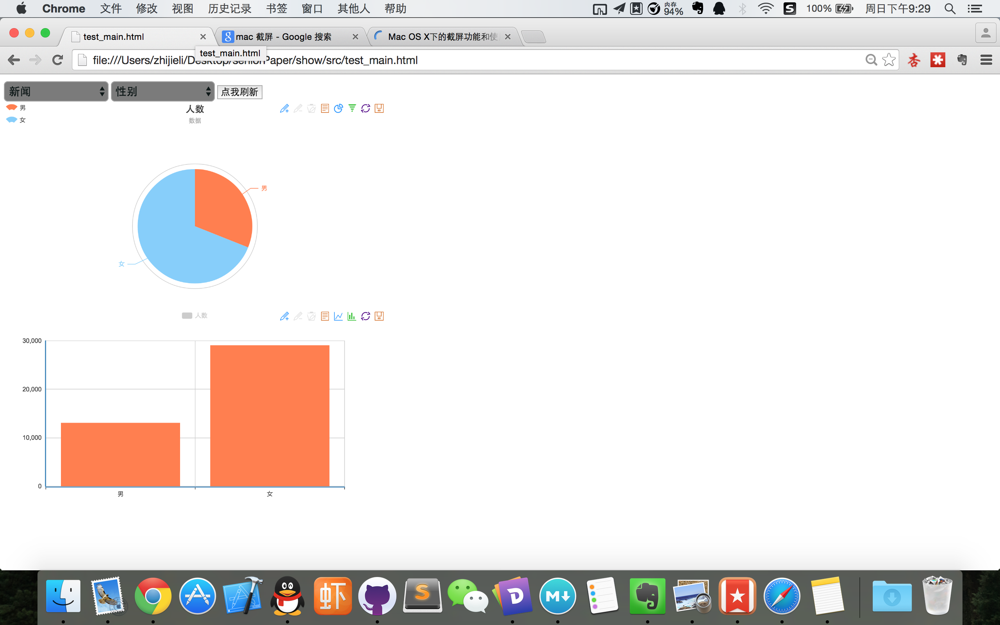
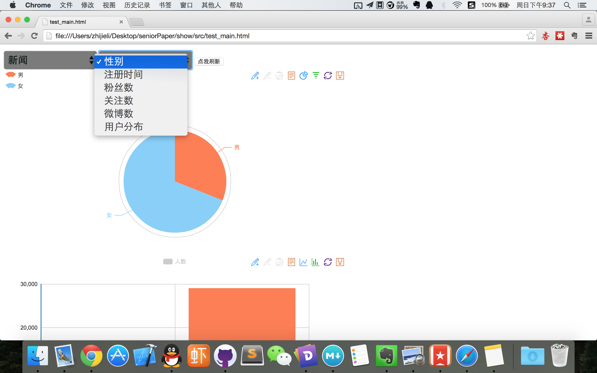

###以下是我毕业设计完成的情况
####我收集的数据分为三类
- 科技
- 娱乐
- 新闻

#####每一类的转发数为2k - 4k 条，理论上来说每一类数据能收集到的用户数是2k - 4k。

就其中一个类别（下面以新闻为例子）来说，其中对其用户中性别进行分析，显示出来的数据图如下：

通过可视化的图（所有数据已通过python分析出来并静态写入到js中），更加直观的显示出每个类别下男女比例和人数的区别，从而得出微博用户中，女性比男性更加对新闻类转发更加积极，从而从侧面说明女性用户更加关注热点类新闻。

具体每个类别的分析如下：

包括性别，注册时间，粉丝数，关注数，微博数，用户分布
####其中，用户分布采用map的形式(人数多少能通过颜色深浅来表示)来显示：

----

###先说一下我的疑问：
- 由于数据都是预先分析好写死在程序中的，所以对于这种展示的模式，只能显示出预先分析好的东西，所以灵活性受限，但是相对来说设计更简单，效率更高，请问曹老师您是否认同这种展示方式？
- 每类中只有一条微博的所有转发，是否应该每一类中要有3条微博的数据，这样更能说明每类微博中用户的倾向？
- 展示方式只有三类的图表：饼状图，柱状图，map图，这样应该足够展示所需要的数据吧？
- 请问曹老师您对我的毕设还有什么意见和要求？

